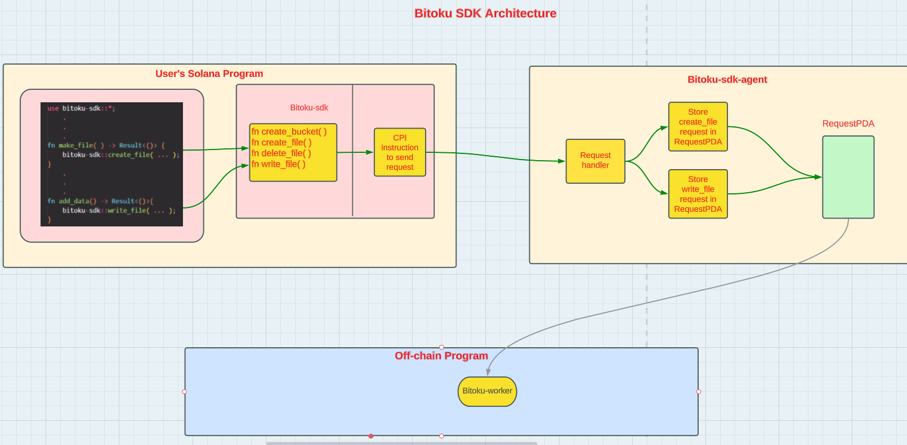

<H1> Bitoku-sdk </H1>

Bitoku is a blockchain-based storage layer for Solana programs.

The overall architecture is depicted in this diagram:

This repo contains Bitoku-sdk, one of the four components of the Bitoku SDK.
